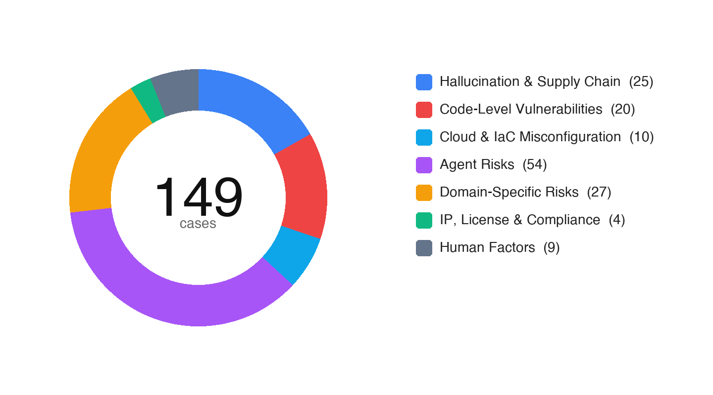
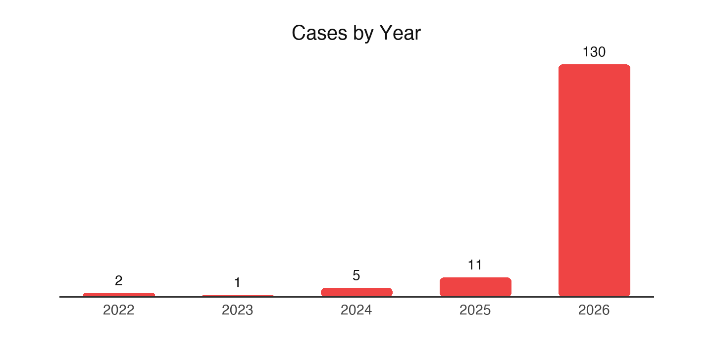

# narwhal-aicode-risks

> *A field guide to security incidents caused by AI-generated code.*

[English](README.md) | [中文](README_CN.md) · [](https://arxiv.org/abs/2512.18567)

This repository documents the **risks** of AI-generated code through layered evidence buckets:

- **Technical Report** — [English PDF](docs/report-en.pdf) · [中文 PDF](docs/report-cn.pdf) · [arXiv](https://arxiv.org/abs/2512.18567)
- **`cases/`** — **149 verified real-world incidents** with primary sources, evidence archives, and bilingual analysis.
- **`inferred/`** — partial-evidence cases: event appears real, but key facts (vendor advisory / CVE / postmortem) not yet pinned down. *(0 cases as of v1.0; submit one!)*
- **`scenarios/`** — illustrative scenarios for a real risk pattern, not tied to a confirmed event.
- **Risk Taxonomy** — 7 categories spanning supply chain, code-level vulnerabilities, cloud / IaC, agent risks, domain-specific risks, IP & compliance, and human factors. See [`docs/taxonomy.md`](docs/taxonomy.md).

> **Companion repository (defenses):** `narwhal-aicode-guardrails` *(coming soon)* — defenses, evaluation benchmarks, and best practices for securing AI-generated code.

> **Verification policy.** Every case has been independently fact-checked against primary sources. Each `meta.yaml` records `severity_basis` (`cvss` / `quantifiable-impact` / `editorial`) and `verification_notes`. See [Verification Status](#verification-status) below.

---

## At a Glance

<table>
<tr>
  <td align="center" width="50%"></td>
  <td align="center" width="50%"></td>
</tr>
</table>

**149 cases · 7 active categories · 2022 → 2026 · 358+ AI tools implicated · 93 cases anchored to public CVEs (CVSS 4 / 5 / 6 / 7 / 8 / 9 / 10)**

---

## Hall of Shame — Top 5 by Verified Real-World Impact

<table>
<tr>
<td colspan="2" valign="top">

### #1 &nbsp;Lovable AI Platform Data Exposure &nbsp;<sub>(2026)</sub>

<p>
  
  
  <a href="https://nvd.nist.gov/vuln/detail/CVE-2025-48757"></a>
  
  
</p>

<h2>18,697 records leaked &nbsp;·&nbsp; 5,000+ vibe-coded apps unprotected</h2>

Missing Supabase Row-Level Security + inverted-auth RPC on a Lovable-built EdTech app — then a platform-wide regression made public-project chats and source code accessible to any logged-in user for 77 days. RedAccess later found 380,000 public assets across the vibe-coding ecosystem (Lovable / Replit / Base44 / Netlify), ~5,000 with sensitive data.

<a href="cases/2026-ai-platform-data-exposure/"><b>Read case →</b></a>

</td>
</tr>

<tr>
<td width="50%" valign="top">

### #2 &nbsp;Moonwell cbETH Oracle Misconfig &nbsp;<sub>(2026)</sub>

<p>
  
  
  
  
</p>

<h2>$1,779,044.83 &nbsp;<sub>bad debt</sub></h2>

PR #578 (Claude-coauthored, Copilot-reviewed, **28 checks passed**) shipped a cbETH oracle config that returned the cbETH/ETH ratio as a USD price — about $1.12 instead of ~$2,200. Liquidators drained 1,096.317 cbETH within minutes. Official Moonwell postmortem + BlockSec + Cointelegraph + rekt.news.

<a href="cases/2026-smart-contract-price-vuln/"><b>Read case →</b></a>

</td>
<td width="50%" valign="top">

### #3 &nbsp;n8n Path Traversal &nbsp;<sub>(2025)</sub>

<p>
  
  
  <a href="https://nvd.nist.gov/vuln/detail/CVE-2025-55526"></a>
  
</p>

<h2>Public PoC &nbsp;·&nbsp; CWE-22</h2>

Introducing commit `ff958e4` carries `Co-Authored-By: Claude <noreply@anthropic.com>` and ships `os.path.join("workflows", filename)` straight to a download endpoint — `..%5c` walks out of the directory. NVD-confirmed; later picked up by Georgia Tech's Vibe Security Radar and The Register.

<a href="cases/2025-n8n-path-traversal-cve/"><b>Read case →</b></a>

</td>
</tr>

<tr>
<td width="50%" valign="top">

### #4 &nbsp;EchoLeak — M365 Copilot &nbsp;<sub>(2025)</sub>

<p>
  
  
  <a href="https://msrc.microsoft.com/update-guide/vulnerability/CVE-2025-32711"></a>
  
</p>

<h2>First zero-click AI-agent CVE</h2>

A single crafted email — no click required — coerces M365 Copilot's RAG into emitting a markdown image URL that exfiltrates the most sensitive context it can find. Coined "LLM Scope Violation" by Aim Labs (now Cato Networks). Microsoft patched, MSRC scored 9.3.

<a href="cases/2025-agent-prompt-injection-leak/"><b>Read case →</b></a>

</td>
<td width="50%" valign="top">

### #5 &nbsp;Moltbook RLS Data Exposure &nbsp;<sub>(2026)</sub>

<p>
  
  
  
  
</p>

<h2>1.5M API tokens · 35K emails · 4,060 DMs</h2>

Vibe-coded AI-agent social network whose founder publicly stated he doesn't write code. 88:1 agent-to-human ratio + Supabase RLS off + OpenClaw's optimistic-trust defaults = entire DB walkable from a public anon key. Karpathy's reaction shifted from "sci-fi takeoff" to "dumpster fire" within days.

<a href="cases/2026-security-culture-erosion/"><b>Read case →</b></a>

</td>
</tr>
</table>

---

## Case Atlas

<table>
<tr>
<td width="33%" valign="top">

### Hallucination & Supply Chain &nbsp;<sub>(4)</sub>

<sub>AI hallucinates non-existent dependencies, recommends squatted packages, or contaminates install chains.</sub>

- <a href="cases/2024-hallucinated-package-poisoning/"><b>huggingface-cli</b></a> · 2024 · 
- <a href="cases/2026-agent-hallucination-self-spread/"><b>react-codeshift agent self-spread</b></a> · 2026 · 
- <a href="cases/2026-ai-tool-install-chain-abuse/"><b>InstallFix + Bing OpenClaw spoof</b></a> · 2026 · 
- <a href="cases/2026-litellm-pypi-supply-chain-poisoning/"><b>LiteLLM PyPI supply chain poisoning</b></a> · 2026 · 

</td>
<td width="33%" valign="top">

### Code-Level Vulnerabilities &nbsp;<sub>(2)</sub>

<sub>Snippet-level defects in AI-generated code: unsafe API use, missing validation, CVE pattern reintroduction.</sub>

- <a href="cases/2025-n8n-path-traversal-cve/"><b>n8n CVE-2025-55526</b></a> · 2025 ·  
- <a href="cases/2026-mass-cve-reintroduction/"><b>Mass CVE reintroduction</b></a> · 2026 · 

</td>
<td width="33%" valign="top">

### Agent Risks &nbsp;<sub>(1)</sub>

<sub>Prompt injection, tool-call hijacking, architectural biases that surface as security flaws.</sub>

- <a href="cases/2025-agent-prompt-injection-leak/"><b>EchoLeak (M365 Copilot)</b></a> · 2025 ·  

</td>
</tr>

<tr>
<td width="33%" valign="top">

### Domain-Specific Risks &nbsp;<sub>(2)</sub>

<sub>Risks unique to specific domains: smart contracts, AI app platforms, no-code generators.</sub>

- <a href="cases/2026-ai-platform-data-exposure/"><b>Lovable platform data exposure</b></a> · 2026 ·  
- <a href="cases/2026-smart-contract-price-vuln/"><b>Moonwell cbETH oracle ($1.78M)</b></a> · 2026 · 

</td>
<td width="33%" valign="top">

### IP, License & Compliance &nbsp;<sub>(2)</sub>

<sub>Copyright lawsuits, license contamination, training-data IP disputes.</sub>

- <a href="cases/2022-license-pollution-lawsuit/"><b>Doe 1 v. GitHub — filing</b></a> · 2022 · 
- <a href="cases/2026-ip-and-license-compliance/"><b>Doe 1 v. GitHub — 2026 update</b></a> · 2026 · 

</td>
<td width="33%" valign="top">

### Human Factors &nbsp;<sub>(2)</sub>

<sub>Skill erosion, over-reliance on AI, security-culture decay in AI-assisted teams.</sub>

- <a href="cases/2023-samsung-chatgpt-leak/"><b>Samsung ChatGPT data leak</b></a> · 2023 · 
- <a href="cases/2026-security-culture-erosion/"><b>Moltbook RLS exposure</b></a> · 2026 · 

</td>
</tr>

<tr>
<td width="33%" valign="top">

### Cloud & IaC Misconfiguration &nbsp;<sub>(1)</sub>

<sub>Cloud and infrastructure-as-code defaults or generated scripts that expose data or misconfigure access.</sub>

- <a href="cases/2025-ai-iac-s3-breach/"><b>AI-generated IaC public S3 bucket leak</b></a> · 2025 · 
- <a href="scenarios/2025-iac-s3-bucket-leak/"><b>[Scenario] AI Terraform → S3 Public-Read</b></a> · 

</td>
<td width="33%" valign="top">

### Submit a case &nbsp;<sub>(+)</sub>

<sub>Spotted an incident we should document?</sub>

See <a href="CONTRIBUTING.md"><b>CONTRIBUTING.md</b></a> for the bilingual case template, the `meta.yaml` field reference, and verification expectations. We accept real incidents and labelled scenarios.

</td>
<td width="33%" valign="top">

### Auto-generated index

<sub>The full table grouped by category is auto-rendered from <code>meta.yaml</code> files.</sub>

→ <a href="cases/README.md"><b>cases/README.md</b></a>

Run <code>python3 scripts/render_index.py</code> to regenerate after adding a case.

</td>
</tr>
</table>

---

## Verification Status

A 2026-05 verification pass against primary sources reshaped the library:

| Verdict | Count | Notes |
|---|---|---|
| ✅ Real, well-sourced | 14 | All `cases/*` after this round |
| 📘 Illustrative scenario (downgraded from "case") | 1 | `scenarios/2025-iac-s3-bucket-leak/` — phenomenon real, specific incident not corroborated; cited primary sources returned 404 |
| 🔁 Merged duplicates | -1 | The earlier `2026-agent-architecture-bias-db` covered the same Moltbook incident as `2026-security-culture-erosion`; merged into the latter |

Each case's `meta.yaml` carries a `severity_basis` field with one of three values:

- **cvss** — anchored to a public CVE / NVD / vendor advisory (3 cases: n8n, Lovable, EchoLeak)
- **quantifiable-impact** — anchored to a publicly disclosed loss / scope figure that we can cite (8 cases as of this index)
- **editorial** — judgment based on the nature of the risk where no CVSS scale applies (3 cases as of this index)

`verification_notes` in each `meta.yaml` records what was checked and what was changed during verification.

---

## Reproduce

Cases marked `reproducible: true` in `meta.yaml` ship a `code/` directory with the relevant PoC. As of now: 4 cases (n8n path traversal, hallucinated package, react-codeshift agent self-spread, Moltbook RLS exposure).

```bash
git clone https://github.com/Narwhal-Lab/narwhal-aicode-risks.git
cd narwhal-aicode-risks/cases/2025-n8n-path-traversal-cve/code
# follow the case README for run instructions
```

---

## Contributing

We welcome new case submissions. There are two paths:

- **Easy** — Open the [📝 **Submit a case** Issue Form](../../issues/new?template=submit-case.yml). No git/markdown needed; a maintainer will fact-check, convert to a draft PR, and credit you. **SLA: 14 days.**
- **PR** — Copy `cases/_template/` (or `inferred/_template/` / `scenarios/_template/`), fill `meta.yaml` and the bilingual `README.md`, and open a PR. See [`CONTRIBUTING.md`](CONTRIBUTING.md) for the field reference, verification policy, and PR checklist.

Local validation before opening a PR:

```bash
pip install pyyaml
python3 scripts/validate_cases.py             # schema check
python3 scripts/validate_cases.py --check-links   # also HEAD all reference URLs
python3 scripts/render_index.py               # regenerate index + SVGs
```

Every PR runs the same checks via GitHub Actions. See [`.github/workflows/validate.yml`](.github/workflows/validate.yml).

---

## Key Findings (from the Technical Report)

- **Phased Penetration** — AI-generated code has moved through Explosive Exploration → Rational Regression → Stable Collaboration, settling on high-repeatability tasks (tests, docs, boilerplate).
- **Language-Stack Asymmetry** — High penetration in Python / JavaScript / TypeScript; cautious adoption in Rust / C++ and other systems languages.
- **Dual Role in the Vulnerability Lifecycle** — AI is observed as both a *source* of vulnerabilities (later reverted to human implementations during fixes) and an *accelerator* of remediation.
- **Patterned Risk Profile** — AI-introduced defects concentrate in input validation, unsafe API calls, and outdated cryptography; severity distribution mirrors human code, but network-exposed surfaces are over-represented.
- **Three-in-One Mitigation Framework** — Multi-dimensional evaluation benchmarks + intrinsic model security + human-machine collaborative governance, with developers retaining ultimate accountability.

The full technical report is at [`docs/report-en.pdf`](docs/report-en.pdf) (English) / [`docs/report-cn.pdf`](docs/report-cn.pdf) (Chinese).

---

## Citation

To cite this case library and technical report:

```bibtex
@techreport{narwhal2025_aicode_risks,
  title        = {AI-Generated Code in the Wild: Security Risk Study},
  author       = {Tencent Security Platform Department and Narwhal-Lab},
  year         = {2025},
  institution  = {Tencent Security Platform Department, Narwhal-Lab},
  type         = {Technical Report},
  url          = {https://github.com/Narwhal-Lab/narwhal-aicode-risks}
}
```

To cite the related arXiv paper:

```bibtex
@misc{wang2025aicodewildmeasuring,
  title={AI Code in the Wild: Measuring Security Risks and Ecosystem Shifts of AI-Generated Code in Modern Software},
  author={Bin Wang and Wenjie Yu and Yilu Zhong and Hao Yu and Keke Lian and Chaohua Lu and Hongfang Zheng and Dong Zhang and Hui Li},
  year={2025},
  eprint={2512.18567},
  archivePrefix={arXiv},
  primaryClass={cs.SE},
  url={https://arxiv.org/abs/2512.18567}
}
```

A `CITATION.cff` is also provided for GitHub's "Cite this repository" button.

---

## Contributors

Thanks goes to these wonderful people. We use [all-contributors](https://allcontributors.org) — see [CONTRIBUTING.md](CONTRIBUTING.md#recognition) for how to get added.

<!-- ALL-CONTRIBUTORS-LIST:START - Do not remove or modify this section -->
<!-- prettier-ignore-start -->
<!-- markdownlint-disable -->
<table>
  <tbody>
    <tr>
      <td align="center" valign="top" width="14.28%"><a href="https://github.com/TheBinKing"><br /><sub><b>Bin Wang</b></sub></a><br /><a title="Project Management">📆</a> <a title="Research">🔬</a> <a title="Content">📝</a> <a title="Review">👀</a></td>
      <td align="center" valign="top" width="14.28%"><a href="https://github.com/yumkea"><br /><sub><b>Wenjie Yu</b></sub></a><br /><a title="Research">🔬</a> <a title="Content">📝</a></td>
      <td align="center" valign="top" width="14.28%"><a href="https://github.com/YilZhong"><br /><sub><b>Yilu Zhong</b></sub></a><br /><a title="Research">🔬</a> <a title="Content">📝</a></td>
      <td align="center" valign="top" width="14.28%"><a href="https://github.com/GioldDiorld"><br /><sub><b>Hao Yu</b></sub></a><br /><a title="Research">🔬</a> <a title="Content">📝</a></td>
      <td align="center" valign="top" width="14.28%"><a href="https://github.com/jzquan"><br /><sub><b>Jiazheng Quan</b></sub></a><br /><a title="Content">📝</a> <a title="Review">👀</a></td>
      <td align="center" valign="top" width="14.28%"><a href="https://github.com/ZJN514"><br /><sub><b>Jianing Zhou</b></sub></a><br /><a title="Content">📝</a></td>
      <td align="center" valign="top" width="14.28%"><a href="https://github.com/adcdl"><br /><sub><b>Liangliang Qian</b></sub></a><br /><a title="Content">📝</a></td>
    </tr>
    <tr>
      <td align="center" valign="top" width="14.28%"><a href="https://github.com/Y0uYuGe"><br /><sub><b>Like Liu</b></sub></a><br /><a title="Content">📝</a></td>
      <td align="center" valign="top" width="14.28%"><a href="https://github.com/utopiazzr"><br /><sub><b>Zherong Zhang</b></sub></a><br /><a title="Content">📝</a></td>
    </tr>
  </tbody>
</table>
<!-- markdownlint-restore -->
<!-- prettier-ignore-end -->
<!-- ALL-CONTRIBUTORS-LIST:END -->

Contribution emoji key: 📝 Content · 🔬 Research · 👀 Review · 📆 Project management · 🛠 Infrastructure · 🌍 Translation · 🐛 Bug report

---

## Team

<p>
  
  <strong style="margin-left: 8px;">Narwhal Lab</strong>
</p>

<table>
  <tr>
    <td align="center" width="90">
      <a href="https://github.com/TheBinKing">
        
      </a>
      <br/>
      <a href="mailto:thebinking66@gmail.com"><sub><b>Bin Wang</b></sub></a>
    </td>
    <td align="center" width="90">
      <a href="https://github.com/yumkea">
        
      </a>
      <br/>
      <a href="mailto:uuykea@gmail.com"><sub><b>Wenjie Yu</b></sub></a>
    </td>
    <td align="center" width="90">
      <a href="https://github.com/YilZhong">
        
      </a>
      <br/>
      <a href="mailto:tangaaang@gmail.com"><sub><b>Yilu Zhong</b></sub></a>
    </td>
    <td align="center" width="90">
      <a href="https://github.com/GioldDiorld">
        
      </a>
      <br/>
      <a href="mailto:g.diorld@gmail.com"><sub><b>Hao Yu</b></sub></a>
    </td>
    <td align="center" width="90">
      <a href="https://github.com/jzquan">
        
      </a>
      <br/>
      <a href="https://github.com/jzquan"><sub><b>Jiazheng Quan</b></sub></a>
    </td>
    <td align="center" width="90">
      <a href="https://github.com/Y0uYuGe">
        
      </a>
      <br/>
      <a href="https://github.com/Y0uYuGe"><sub><b>Like Liu</b></sub></a>
    </td>
  </tr>
</table>

---

## Acknowledgments and Feedback

Thanks to all contributors and reviewers. If you have suggestions, spot an error, or want to share field experience, open an Issue. For collaboration inquiries, email **thebinking66@gmail.com**.

## License

© 2025 Narwhal Lab. Licensed under [**CC BY 4.0**](LICENSE) — attribution to Narwhal Lab is required.
