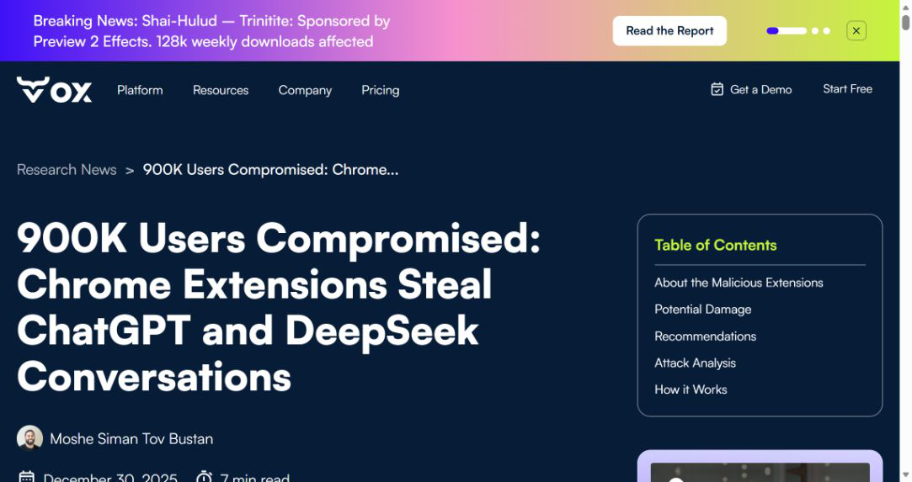
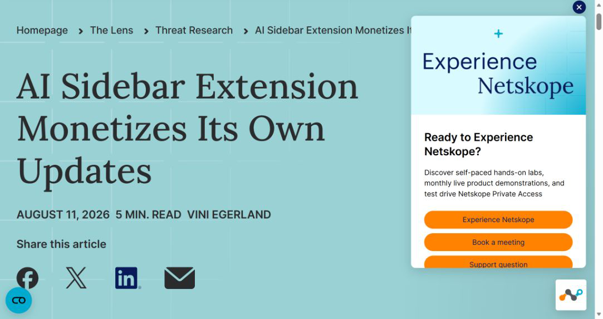
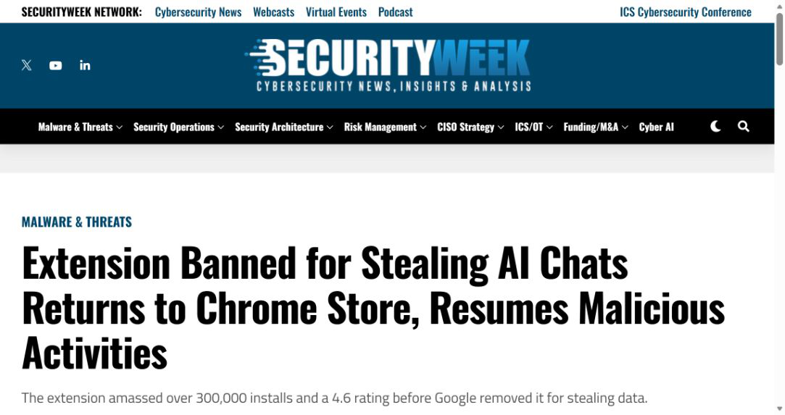
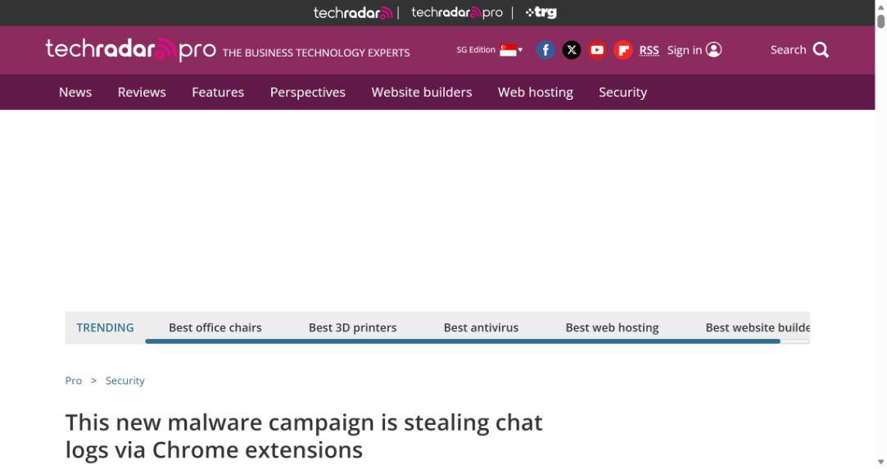
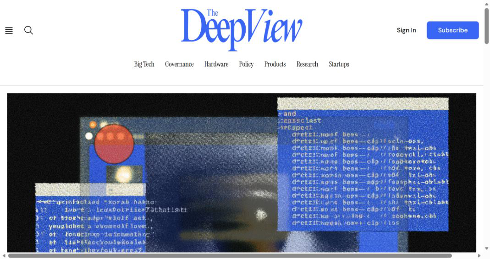

# AI Sidebar Chat Theft and Chrome Store Relisting (2026)
> AI Sidebar 窃取聊天记录后重返 Chrome 商店并再次投放恶意更新

| Field | Value |
|---|---|
| Category | privacy |
| Severity | High |
| AI Tool | ChatGPT, DeepSeek, Claude, AI Sidebar Chrome extension |
| Real Incident | Yes |
| Reproducible | No |
| Disclosed | 2026-01-07 |

## TL;DR

两款仿冒 AI 侧边栏扩展读取 ChatGPT 与 DeepSeek 页面中的提示和回复，每 30 分钟发送到外部服务器。Google 下架后，其中一款又以相同扩展 ID 重返商店，先发布干净版本，再通过更新加入静默联盟营销跳转。

---

## 一、事件概况

OX Security 在 2025 年 12 月 29 日报告两款恶意 Chrome 扩展，并于 2026 年 1 月获得广泛公开报道。两款产品仿冒正常的 AITOPIA 多模型侧边栏，合计显示超过 90 万次安装，其中 `AI Sidebar with DeepSeek, ChatGPT, Claude and more` 约 30 万次并拥有 4.6 分。扩展功能可以正常使用，同时监听页面中的 ChatGPT 和 DeepSeek 会话。

Google 于 2026 年 1 月下架相关扩展。Netskope 在 7 月又从企业终端看到相同 ID 经 Google CRX 基础设施分发：1.7.2.0 先保持干净，1.7.3.0 加入 21 行联盟营销代码，在更新和卸载时静默打开前台页面。8 月 25 日更新显示 1.7.4 仍在商店、约 20 万用户。新版本没有恢复聊天窃取代码，但证明原发布者重新获得了更新通道。

## 二、公开资料核对

OX 原始分析给出扩展 ID、版本、哈希、C2、DOM 读取和 30 分钟批量外传逻辑。Netskope 独立取得 2026 年新 CRX，对干净版和恶意更新做差异分析，并用企业遥测确认持续分发。SecurityWeek、TechRadar 与 SOCRadar 对安装量、下架、重新上架和数据类型进行复核。

90 万是两款扩展的商店安装展示总量，不能等同于 90 万段会话都被盗。Netskope 的数百次每日获取来自其客户可见范围。本文把 2025 年末的数据窃取与 2026 年的重新投放分开，避免让读者误以为 1.7.3.0 仍执行相同外传。

| 来源 | 类型 | 主要核验内容 |
|---|---|---|
| [OX Security original analysis](https://www.ox.security/blog/malicious-chrome-extensions-steal-chatgpt-deepseek-conversations/) | 原始恶意扩展分析 | 会话窃取代码与 IOC |
| [Netskope relisting analysis](https://www.netskope.com/blog/ai-sidebar-extension-monetizes-its-own-updates) | 独立更新链分析 | 重新上架和恶意更新 |
| [SecurityWeek report](https://www.securityweek.com/extension-banned-for-stealing-ai-chats-returns-to-chrome-store-resumes-malicious-activities/) | 安全媒体复核 | 商店处置与安装量 |
| [TechRadar original campaign report](https://www.techradar.com/pro/security/this-new-malware-campaign-is-stealing-chat-logs-via-chrome-extensions) | 新闻复核 | 原活动复核 |
| [The Deep View report](https://www.thedeepview.com/articles/ai-add-ons-steal-chat-data-from-900k-users) | 技术摘要复核 | DOM 外传机制 |

## 三、攻击或事件过程

恶意扩展请求读取网页和标签页的宽泛权限，以所谓匿名使用分析获得用户同意。用户打开 ChatGPT 或 DeepSeek 时，内容脚本定位对话 DOM，提取用户提示、模型回复、会话 URL 和浏览标签信息，先存入本地数据库，再以 Base64 编码批量发送到 `deepaichats`、`chatsaigpt` 等外部端点。编码只改变传输形式，不提供保密性。

下架后的第二阶段采用 clean-then-poison。相同扩展 ID 重新上架后，干净版本运行数周，随后更新加入监听 `runtime.onUpdateAvailable` 和卸载 URL 的代码。扩展每次更新或移除都会打开可变短链并带联盟参数，运营者可通过发布节奏重复获利。

自动更新意味着已安装用户不必再次点击授权。商店审核、原扩展 ID 和 Google CDN 共同提高了新版本的可信外观。

## 四、技术分析

第一阶段的直接问题是浏览器扩展权限过宽且隐私声明不实。ChatGPT 和 DeepSeek 的页面内容存在浏览器 DOM 中，拥有 all-sites 读取能力的扩展可以在模型服务加密传输完成后直接截取。模型提供商无法从服务器端阻止一个已获本机权限的扩展读取页面。

第二阶段暴露扩展供应链的持续信任。Google 下架并不清除终端，重新上架后相同 ID 可继续更新。短暂干净版本降低审核风险，随后只插入少量代码，恶意变化容易藏在大型功能包中。

联盟跳转本身影响低于会话窃取，但同一更新能力可以投放任意脚本。风险评估应同时看当前 payload 和发布者对未来版本的控制权。

## 五、AI 安全问题

AI 会话常包含尚未进入正式系统的源代码、客户资料、合同、故障日志、密钥片段和个人问题。扩展不是偷一个普通网页字段，而是持续收集用户与多家模型的完整上下文，能还原工作任务、身份和内部项目。

这类攻击利用“多模型聚合”的需求。用户为了在同一侧边栏调用 ChatGPT、DeepSeek 和 Claude，会接受全站访问和页面注入权限；恶意产品又保持真实功能，使异常不易察觉。AI 产品的使用界面因此成为新的高价值数据面。

模型安全设置无法保护已渲染的聊天。组织必须把浏览器扩展、桌面壳和第三方输入法纳入 AI 数据治理，而不能只审查模型供应商。

## 六、影响与处置

企业应按 OX 与 Netskope 公布的两个扩展 ID、版本和 SHA-256 清点浏览器。发现后先禁用并保存 CRX 与浏览器配置，再删除扩展；检查 2025 年末至 2026 年初对外传域名的连接，以及 2026 年 7 月后 Bitly 和联盟跳转。被读取会话中出现的凭据需要轮换。

Google 下架或当前商店页面消失不能证明终端已清理。浏览器管理平台应核对 force-install、allowlist 和用户配置，防止相同 ID 恢复。历史 DNS、代理和 EDR 数据可帮助判断是否发生周期性批量发送。

安装量无法确定个人是否被外传。事件通知应结合扩展实际运行时间、用户访问过的 AI 站点和网络证据。

## 七、防护建议

企业浏览器采用默认拒绝扩展策略，审批不仅看名称、评分和 Featured 标识，还要核验发布者、权限、隐私目的和代码更新。高风险扩展固定版本或使用内部重新打包，并对 CRX 每次更新执行差异和行为分析。

AI 会话尽量通过受管应用访问，禁止未批准扩展读取相关域名。数据防泄漏策略覆盖浏览器页面和扩展网络请求，对周期性发送长 Base64 内容、新注册域名和短链跳转告警。

商店运营方需要在重新上架时审查历史处罚、扩展 ID 所有权和开发者关系，并向现有安装明确提示。一次下架后的恢复不应自动继承原有信任和用户基数。

## 八、结论

AI Sidebar 案例跨越了数据窃取、商店下架、干净更新和再次投毒。它说明浏览器扩展能同时获得 AI 会话内容与长期更新权。组织清点 AI 使用时，必须把围绕模型运行的客户端组件一并纳入控制。

### 参考来源

1. [OX Security original analysis](https://www.ox.security/blog/malicious-chrome-extensions-steal-chatgpt-deepseek-conversations/)
2. [Netskope relisting analysis](https://www.netskope.com/blog/ai-sidebar-extension-monetizes-its-own-updates)
3. [SecurityWeek report](https://www.securityweek.com/extension-banned-for-stealing-ai-chats-returns-to-chrome-store-resumes-malicious-activities/)
4. [TechRadar original campaign report](https://www.techradar.com/pro/security/this-new-malware-campaign-is-stealing-chat-logs-via-chrome-extensions)
5. [The Deep View report](https://www.thedeepview.com/articles/ai-add-ons-steal-chat-data-from-900k-users)
