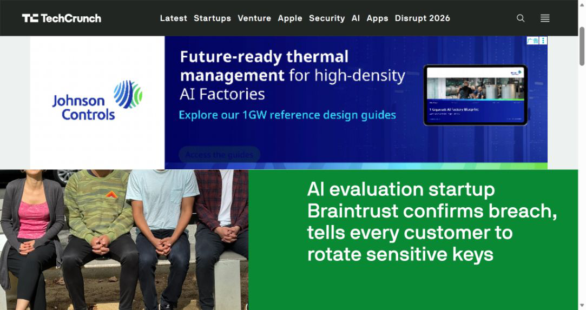
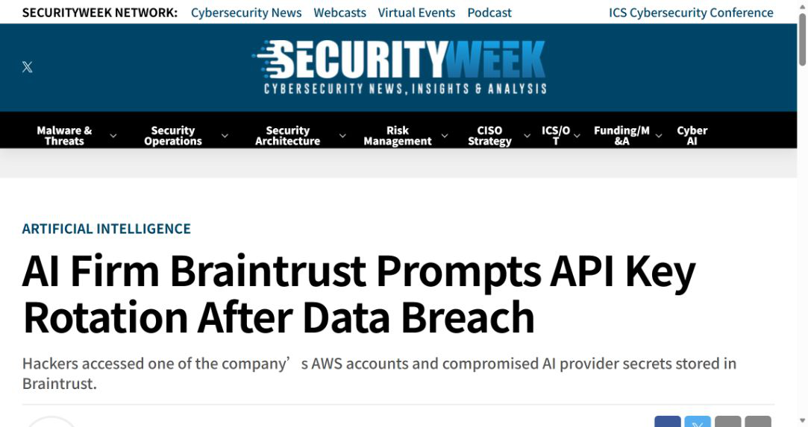
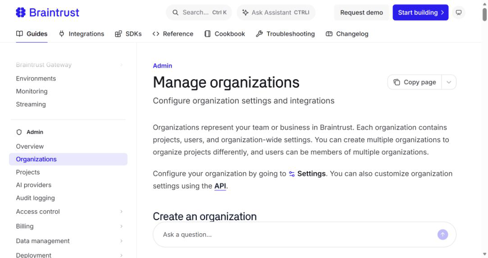
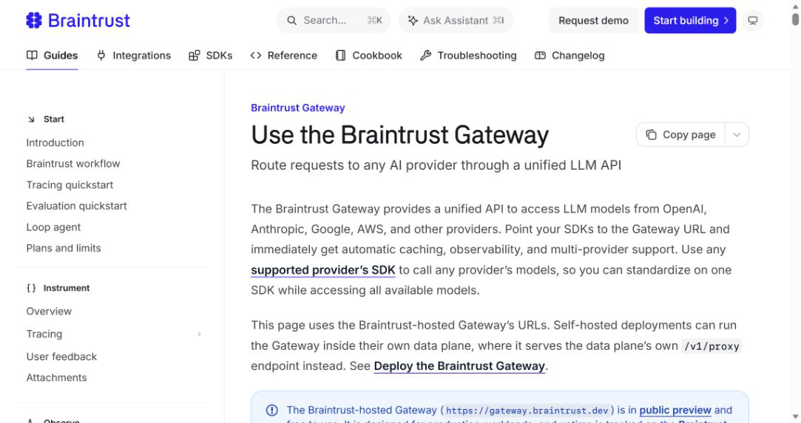
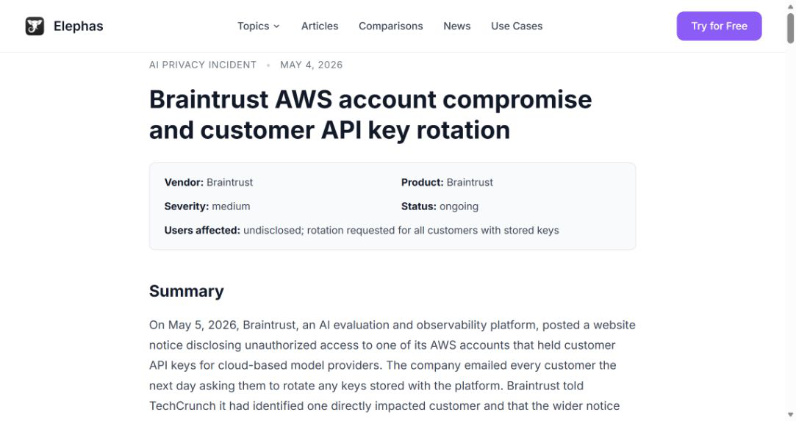

# Braintrust AWS AI Provider Key Exposure (2026)
> Braintrust 云账户未授权访问与 AI Provider Key 轮换事件

| Field | Value |
|---|---|
| Category | privacy |
| Severity | High |
| AI Tool | Braintrust, LLM provider APIs, Braintrust AI gateway |
| Real Incident | Yes |
| Reproducible | No |
| Disclosed | 2026-05-05 |

## TL;DR

Braintrust 在一个 AWS 账户中发现未授权访问。该环境可能包含客户保存的模型服务 Provider Key，公司因此要求所有相关客户轮换组织级 AI 密钥，并锁定账户、限制关联系统和更新内部秘密。

---

## 一、事件概况

2026 年 5 月 4 日，Braintrust 收到一个 AWS 账户出现可疑活动的报告，随后确认存在未授权访问。Braintrust 是 AI 评测、可观测与网关平台，客户可在组织或项目级保存 OpenAI、Anthropic、Google、Azure 等模型提供商的密钥，由平台代表应用调用模型。事件因此不仅涉及 Braintrust 自身账号，也可能触及下游模型账户的访问能力。

公司在 5 月 5 日通知客户，并要求所有在平台中保存 AI Provider Key 的客户轮换。公开时，Braintrust 表示已与一名确认受影响客户沟通，尚未发现更广泛暴露；SecurityWeek 随后报道另有三名客户观察到可疑模型用量。Braintrust 锁定受影响账户、审计并限制关联系统、轮换内部秘密，事件原因当时仍在调查。

## 二、公开资料核对

TechCrunch 获取客户邮件并引用 Braintrust 公开通知和发言人回应；SecurityWeek 对发现时间、全量轮换建议以及额外异常用量报告作了复核。Braintrust 当前组织和 Gateway 文档直接说明组织级 Provider Key 会作为各项目默认凭据，网关使用这些密钥代表客户请求模型。

来源之间存在措辞差异：新闻标题常用 breach，发言人则强调确认的是 security incident，并称没有证据支持更广泛暴露。本文保留两层事实：一个 AWS 账户发生未授权访问；至少一名客户确认受影响；其余密钥处于需要预防性轮换的范围。全量轮换通知不能反推所有密钥都被复制。

| 来源 | 类型 | 主要核验内容 |
|---|---|---|
| [TechCrunch incident report](https://techcrunch.com/2026/05/06/ai-evaluation-startup-braintrust-confirms-breach-tells-every-customer-to-rotate-sensitive-keys/) | 事件报道与厂商引述 | 未授权访问与客户通知 |
| [SecurityWeek report](https://www.securityweek.com/ai-firm-braintrust-prompts-api-key-rotation-after-data-breach/) | 安全媒体复核 | 发现时间与异常用量 |
| [Braintrust organization and secret documentation](https://www.braintrust.dev/docs/admin/organizations) | 厂商秘密管理文档 | 组织级秘密存储 |
| [Braintrust gateway documentation](https://www.braintrust.dev/docs/deploy/gateway) | 厂商网关文档 | Provider Key 调用链 |

## 三、攻击或事件过程

Braintrust 的工作模式决定了影响路径。客户先把 Provider Key 配置在组织或项目设置中，应用调用 Braintrust Gateway 时只携带 Braintrust 身份，网关再选择并使用对应模型凭据。这样便于统一追踪、缓存和评测，却让第三方平台成为多家模型供应商密钥的集中保管点。

攻击者进入相关 AWS 账户后，潜在目标包括保存或处理 Provider Key 的服务、日志、缓存、部署配置与内部访问令牌。公开材料没有说明初始访问方式，也没有列出被读取的具体存储对象，因此不能构造未经证实的 IAM 或数据库攻击链。已知响应动作表明 Braintrust 无法在第一时间排除客户秘密接触风险，于是要求所有相关客户自行吊销并重建。

被盗模型密钥可用于消耗额度、访问允许的模型和部分供应商资源，权限取决于供应商设置。异常用量可能出现在 Braintrust 之外，所以调查不能只查 Braintrust 日志。

## 四、技术分析

根本风险是跨供应商凭据集中与事件响应分散。组织级密钥为了方便在所有项目中复用，往往权限较广、寿命较长。Braintrust 账户失陷后，客户必须分别进入各模型提供商完成撤销，平台无法保证复制出去的密钥失效。

秘密加密存储并不自动消除运行时暴露。Gateway 要代表客户发起请求，就必须在某个受控执行路径中取得可用凭据；AWS 账户、服务身份和内部管理权限成为关键边界。安全设计应限制哪个工作负载可以解密哪个项目的密钥，并记录每次使用。

公开资料没有足够细节判断是哪一项控制失败。可以确定的是，一个供应商云账户的未授权访问触发了跨客户、跨模型平台的密钥轮换，这说明 AI 基础设施已经具备传统 API Gateway 与秘密管理系统相同的高价值。

## 五、AI 安全问题

AI 关联体现在被集中保管和可能被滥用的资产是模型 Provider Key，而 Braintrust Gateway 正以这些密钥代理实际推理。它们不仅代表计费额度，还可能访问微调模型、文件、批处理、日志或其他由供应商 API 暴露的资源。不同提供商权限模型差异很大，风险不能只用“token 费用”衡量。

评测和可观测平台通常横跨开发、测试与生产，能看到提示、输出和追踪数据，同时持有模型密钥。一旦将组织级凭据作为默认值，单个平台账号便连接多个项目。AI 工程团队在追求统一观测时，需要同时评估秘密集中带来的供应链影响。

事件没有显示模型自主参与攻击，也没有证据表明模型输出导致入侵。它仍属于 AI 基础设施安全案例，因为受影响凭据和业务调用链直接围绕模型服务。

## 六、影响与处置

收到通知的客户应在原模型提供商处吊销旧 Provider Key，创建权限更小的新密钥，再更新 Braintrust。只在 Braintrust 页面覆盖值而未撤销上游密钥，无法阻止攻击者继续使用已复制内容。轮换后核对最后更新时间，并检查 5 月 4 日前后各供应商的调用量、来源 IP、模型选择、文件访问和费用变化。

组织还要审查 Braintrust 自身 API Key、服务 token 和成员权限，确认没有把 Provider Key 复制到环境变量、CI 日志或项目配置。发现异常模型调用时，保留供应商账单与请求 ID，区分合法 Gateway 流量和直接使用旧密钥的请求。

未收到确认影响通知的客户仍被要求预防性轮换，但调查结论应区分“完成风险处置”和“发现实际滥用”。公开的客户数量不足以估算事件总体规模。

## 七、防护建议

模型凭据应按提供商、项目和环境拆分，设置用量、模型和来源限制；能使用云工作负载身份或短期 token 时，不保存长期静态密钥。Gateway 只在当前请求中取得必要凭据，后台管理服务不拥有批量解密能力。

平台方需要提供客户可导出的密钥使用审计、紧急全局禁用和逐项目撤销接口。高权限云账户采用硬件身份、多方审批和异常地域检测，秘密访问日志与普通应用日志分开保存。

采购评估应询问第三方 AI 平台如何隔离组织级秘密、谁可解密、备份与缓存是否包含密钥，以及供应商失陷时客户能否在小时级完成跨平台轮换。便利的统一网关不能以不可见的集中权限为代价。

## 八、结论

Braintrust 事件公开细节有限，但事实链清楚：云账户发生未授权访问，AI Provider Key 存在潜在暴露，至少一名客户确认受影响，平台要求全部相关客户轮换。报告应依据这些确认项开展处置，同时避免把预防性范围写成全部密钥已泄露。

### 参考来源

1. [TechCrunch incident report](https://techcrunch.com/2026/05/06/ai-evaluation-startup-braintrust-confirms-breach-tells-every-customer-to-rotate-sensitive-keys/)
2. [SecurityWeek report](https://www.securityweek.com/ai-firm-braintrust-prompts-api-key-rotation-after-data-breach/)
3. [Braintrust organization and secret documentation](https://www.braintrust.dev/docs/admin/organizations)
4. [Braintrust gateway documentation](https://www.braintrust.dev/docs/deploy/gateway)
