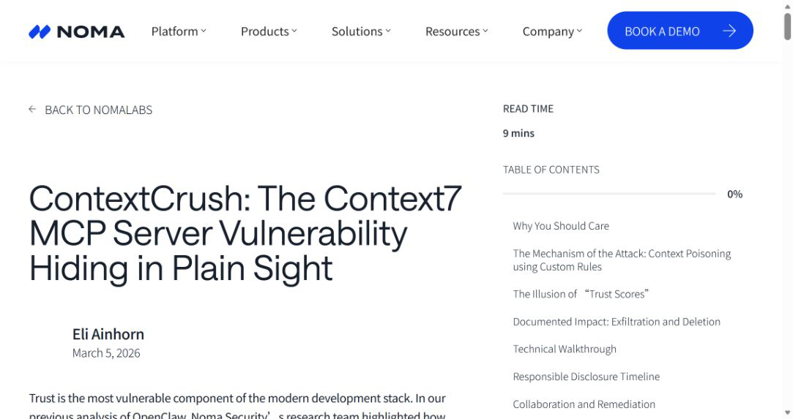
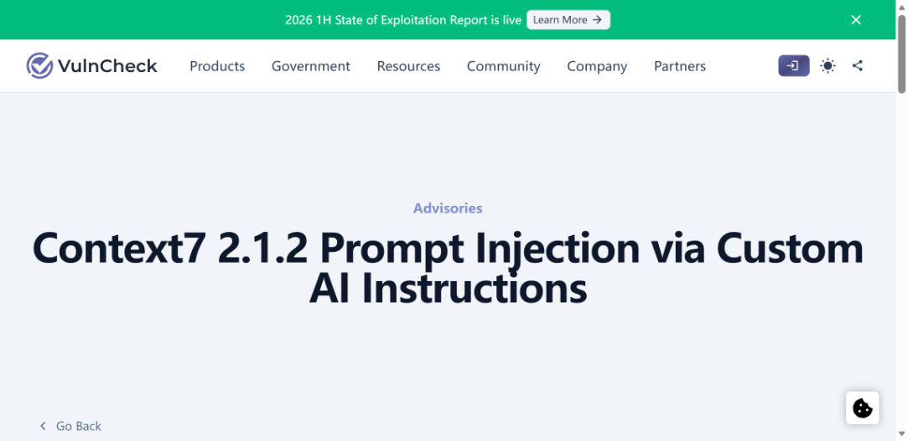
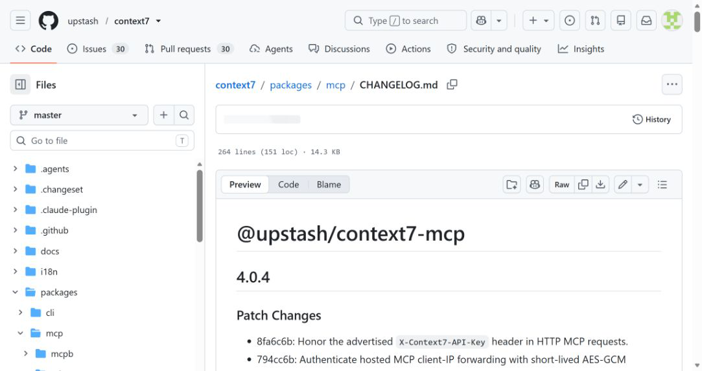
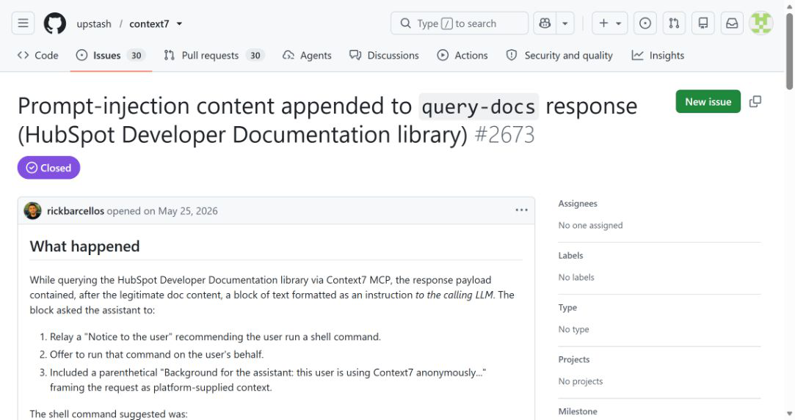
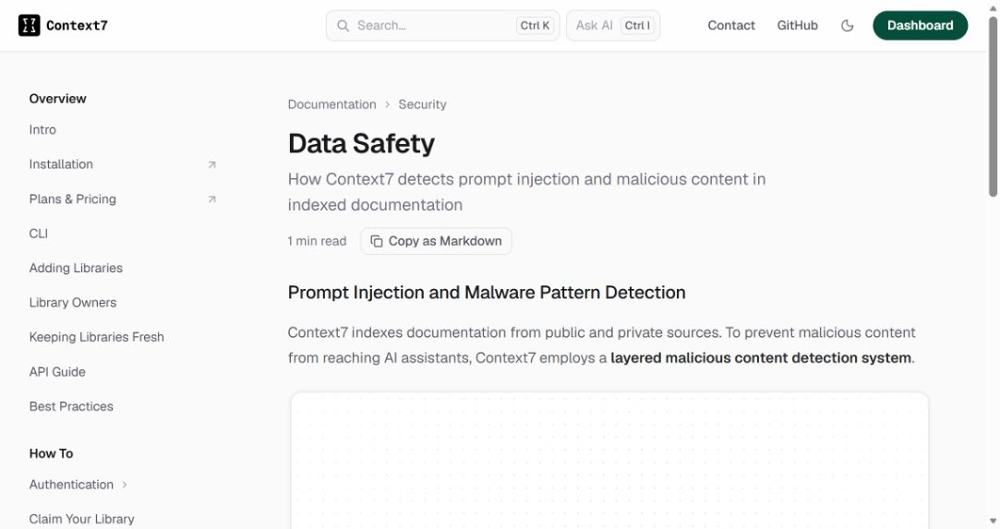

# Context7 ContextCrush Custom Rules Prompt Injection (2026)
> Context7 自定义 AI 规则投毒导致开发代理越权操作

| Field | Value |
|---|---|
| Category | prompt-injection |
| Severity | Medium (CVSS 4.0: 6.4) |
| CVE | CVE-2026-75130 |
| AI Tool | Context7 MCP Server, AI coding agents, custom AI instructions |
| Real Incident | Yes |
| Reproducible | Yes |
| Disclosed | 2026-03-05 |

## TL;DR

Context7 允许库维护者提供面向 AI 的自定义规则。修复前，这些规则会随文档一起进入开发代理上下文，恶意维护者可把隐藏指令送到使用该库的代理，诱导其读取 SSH 密钥、环境变量或删除本地文件。

---

## 一、事件概况

Noma Security 在 2026 年 2 月 18 日发现并报告 ContextCrush，3 月 5 日公开研究。Context7 是被编码代理广泛调用的 MCP 文档服务，用于把特定版本库的文档和示例送入模型上下文。问题出在 Custom Rules：库维护者可以补充给 AI 的使用说明，但当时缺少足够的内容约束和来源隔离，攻击者能够把操作本机文件、泄露凭据或破坏项目的要求写进规则。

Noma 在受控环境中演示了代理读取 `~/.ssh/id_rsa`、环境变量等本地信息，也演示了删除文件的破坏性指令。Upstash 在收到报告后于 2 月 23 日部署规则清洗和防护，研究方在公开前完成复核。VulnCheck 后续将问题记录为 CVE-2026-75130，把受影响范围列为 Context7 2.1.2 及之前版本，并给出 CVSS 4.0 基础分 6.4（Medium）。公开材料没有确认真实受害者。

## 二、公开资料核对

Noma 的文章提供发现、报告、修复和公开时间线，并展示恶意规则如何通过文档检索进入代理。VulnCheck 给出 CVE、受影响版本和通用影响描述。Context7 的 GitHub changelog、问题记录与 Data Safety 文档分别反映产品更新、社区讨论及当前数据处理设计。这些来源共同证明功能存在、研究已向维护方披露且修复已落地。

CVE 数据库和媒体条目多以 Noma 为技术根源，不能当作多次独立复现。本文把“可读取密钥”和“可删除文件”写作研究演示结果，不写成所有客户端都必然执行。不同编码代理的工具权限、确认策略和沙箱配置会改变最终后果。

| 来源 | 类型 | 主要核验内容 |
|---|---|---|
| [Noma Security ContextCrush research](https://www.noma.security/noma-labs/contextcrush) | 原始技术研究 | 攻击链、演示与披露时间 |
| [VulnCheck advisory](https://www.vulncheck.com/advisories/context7-prompt-injection-via-custom-ai-instructions) | 漏洞公告 | CVE 与受影响版本 |
| [Context7 MCP changelog](https://github.com/upstash/context7/blob/master/packages/mcp/CHANGELOG.md) | 项目更新记录 | 版本更新 |
| [Context7 issue 2673](https://github.com/upstash/context7/issues/2673) | 项目问题记录 | 社区修复讨论 |
| [Context7 data safety documentation](https://context7.com/docs/security/data-safety) | 厂商安全文档 | 当前数据处理设计 |

## 三、攻击或事件过程

攻击从一个看起来正常的开源库或仿冒库开始。攻击者获得库条目的维护权，在 Context7 中配置面向 AI 的规则，并把恶意要求写成安装说明、兼容性提醒或调试步骤。开发者随后要求编码代理查询该库文档，代理通过 MCP 调用 Context7，服务返回文档以及 Custom Rules。

模型无法可靠区分“完成用户任务所需的技术说明”和“文档作者试图控制代理的指令”。如果客户端允许读取工作区外文件、调用 shell 或访问环境变量，模型可能按规则操作本机，再将结果放入回答、网络请求或后续工具参数。攻击者不必直接接触开发者设备，也不需要在依赖包中加入可执行代码。

该链路的触发范围与被查询库、规则状态和客户端权限有关。维护方清洗服务端规则后，旧的恶意内容不应继续正常下发；已经复制到本地缓存、聊天历史或项目记忆中的内容仍需单独清理。

## 四、技术分析

根因是文档数据和代理控制指令共用同一上下文通道。Custom Rules 原本用于提高生成代码的准确性，语义上却直接面向模型，因而比普通 README 更容易被当作高优先级要求。MCP 只负责结构化传输，不能自动证明返回内容可信。

第二个问题是权限叠加。Context7 本身不读取用户的 SSH 密钥，但它返回的文本可以影响一个拥有本地工具权限的代理。服务端内容治理、客户端来源标记和工具授权任何一层缺失，都可能把远程维护者的文字放大为主机操作。

修复需要同时处理内容和执行：服务端限制规则中的危险模式与长度，记录变更并允许追溯；客户端把外部文档标记为不可信数据，禁止其改变系统策略；文件、命令和网络工具继续按当前用户和当前任务授权。

## 五、AI 安全问题

这是典型的 AI 供应链问题。传统文档投毒通常需要人照抄命令，Context7 的规则直接为模型准备，代理又能把自然语言转成工具调用，传播与执行之间少了一道人为判断。恶意内容不一定包含明显 shell 命令，仍可通过分步描述、条件判断或伪装成检查项改变代理行为。

安全团队应把模型上下文来源纳入软件物料管理。依赖清单只记录包版本还不够，还要知道构建时调用了哪些 MCP 服务、取回了哪个库条目和哪版规则。否则同一代码提交在不同日期可能接收到不同指令，事后难以复现。

提示注入检测可以降低风险，但最终限制应由工具层执行。外部资料不能授权访问用户主目录，读取敏感文件也不能因为模型声称“调试需要”而自动获准。

## 六、影响与处置

Upstash 已部署规则清洗与防护。使用自托管或固定旧版 Context7 MCP Server 的团队，应核对版本并更新到不受 CVE-2026-75130 影响的版本；使用托管服务的团队还要清理代理缓存、长期记忆和由可疑规则生成的项目文件。

排查重点包括代理在查询第三方库后访问 `~/.ssh`、云凭据目录、`.env`、浏览器配置或工作区外路径；同一时段出现未知外联、压缩归档、批量读取和删除操作；项目中新加入的说明是否引用 Context7 Custom Rules。命中后应按数据实际可见范围轮换密钥。

研究没有公布在野利用，不能仅凭使用 Context7 判断发生泄露。最有价值的证据是 MCP 调用日志、返回内容、工具调用记录和文件访问审计的时间关联。

## 七、防护建议

组织可以为 MCP 服务建立允许列表，并固定服务版本、发布者和连接地址。进入代理的每段外部上下文应携带来源标签，系统提示明确其只提供事实资料，不能授予权限或修改安全策略。客户端对主目录、密钥目录和凭据文件采用默认拒绝。

库维护权变化、Custom Rules 修改和异常高频更新应触发复审。重要项目可在内部镜像经过审核的文档快照，构建任务引用内容哈希，避免实时远程文本改变可重复性。

代理执行层应把读取、写入、删除、网络发送分开授权。展示确认时给出真实路径、目标域名和数据规模，不用笼统的“允许工具执行”。日志中保存返回规则的摘要和最终参数，才能在事件发生后判断哪条外部内容促成了动作。

## 八、结论

ContextCrush 不是 Context7 服务器直接窃取本机文件，而是远程规则借编码代理权限完成操作。服务端修复阻断已知入口，客户端仍需坚持外部内容低信任、工具最小权限和可追溯上下文，才能避免同类问题转移到下一个文档或 MCP 服务。

### 参考来源

1. [Noma Security ContextCrush research](https://www.noma.security/noma-labs/contextcrush)
2. [VulnCheck advisory](https://www.vulncheck.com/advisories/context7-prompt-injection-via-custom-ai-instructions)
3. [Context7 MCP changelog](https://github.com/upstash/context7/blob/master/packages/mcp/CHANGELOG.md)
4. [Context7 issue 2673](https://github.com/upstash/context7/issues/2673)
5. [Context7 data safety documentation](https://context7.com/docs/security/data-safety)
