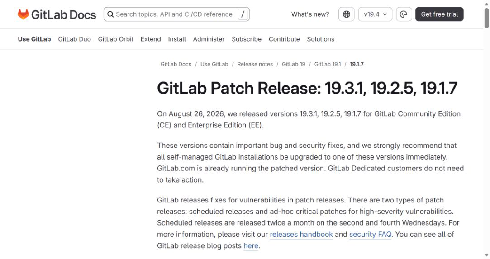
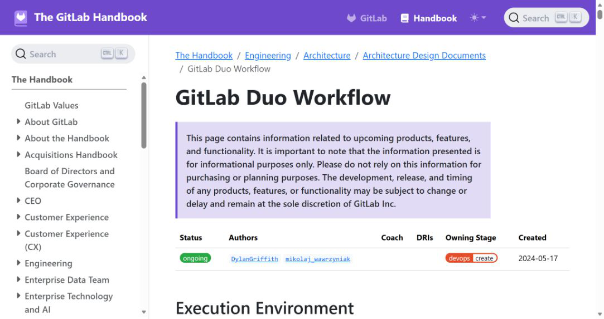
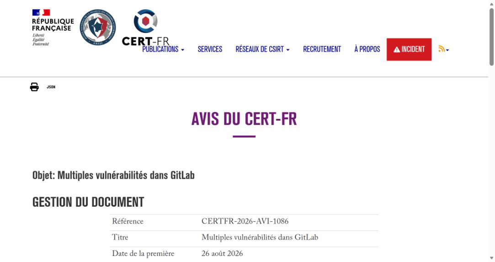
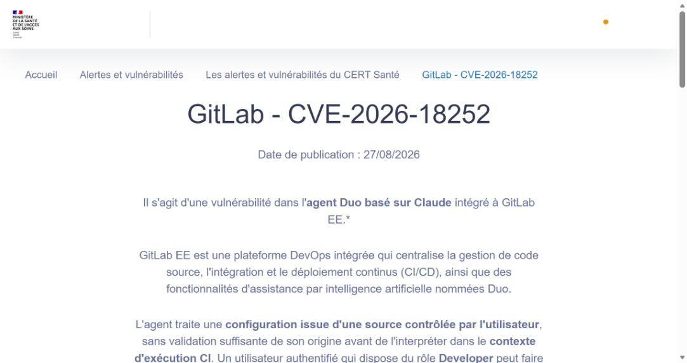
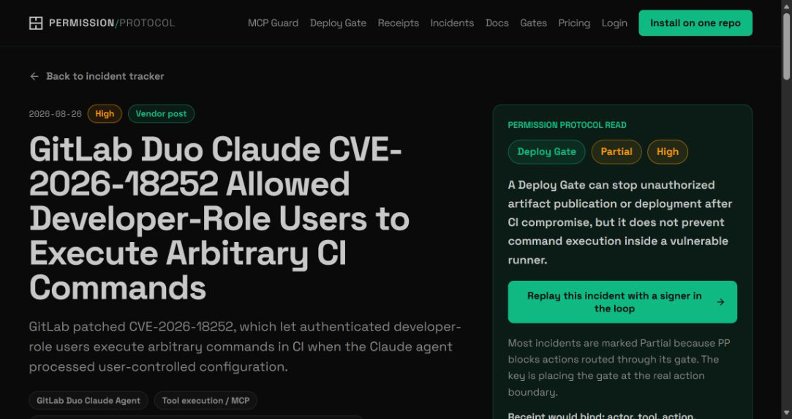

# GitLab Duo Claude Agent CI Command Execution (2026)
> GitLab Duo Claude Agent 用户配置触发 CI 命令执行

| Field | Value |
|---|---|
| Category | code-vulns |
| Severity | High |
| CVE | CVE-2026-18252 |
| AI Tool | GitLab Duo Claude Agent, GitLab CI/CD |
| Real Incident | Yes |
| Reproducible | No |
| Disclosed | 2026-08-26 |

## TL;DR

GitLab Duo Claude Agent 在特定条件下会处理开发者能够控制的配置来源，使具备 Developer 权限的用户有机会把配置内容带入 Agent 的执行链，并在 CI 环境中运行任意命令。GitLab 已在 19.1.7、19.2.5 和 19.3.1 修复。

---

## 一、事件概况

2026 年 8 月 26 日，GitLab 在 19.3.1、19.2.5 和 19.1.7 补丁公告中披露 CVE-2026-18252。受影响对象是 GitLab EE 中的 Duo Claude Agent：在满足特定条件时，具有项目 Developer 权限的已认证用户可以让 Agent 处理来自用户可控位置的配置，进而在 CI 上下文执行任意命令。GitLab 将该问题评为 High，CVSS 3.1 为 7.3，向量中的用户交互要求也说明利用并非只靠一个匿名网络请求即可完成。

受影响版本从 18.9 开始，19.1 分支低于 19.1.7、19.2 分支低于 19.2.5、19.3 分支低于 19.3.1。GitLab.com 在公告发布时已经运行修复版本，Dedicated 客户无需采取额外动作；自托管实例需要升级。公开公告没有报告在野利用，也没有公开完整利用样例。

## 二、公开资料核对

GitLab 补丁公告是版本、评分和影响描述的直接来源。CVE 记录与法国 CERT Santé 的告警复核了编号、权限前提及修复分支；GitLab 自身的 Duo Workflow 架构文档则解释了为什么 CI 是高价值边界：Agent 会在 runner 中执行工作流，读取项目内容，并使用工具完成代码修改、测试和其他任务。

目前能确认的是“用户可控配置进入 Claude Agent，并导致 CI 命令执行”。GitLab 说明相关安全 Issue 要在补丁发布 90 天后才公开，因此配置文件的确切名称、解析顺序和完整请求序列尚未进入公共材料。报告不补写未披露的实现细节，也不把 7.3 分值改成其他来源给出的估算值。

| 来源 | 类型 | 主要核验内容 |
|---|---|---|
| [GitLab patch release](https://docs.gitlab.com/releases/patches/patch-release-gitlab-19-3-1-released/) | 厂商安全公告 | 版本、评分与修复 |
| [GitLab Duo Workflow architecture](https://handbook.gitlab.com/handbook/engineering/architecture/design-documents/duo_workflow/) | 厂商架构资料 | Agent 在 CI 中的执行边界 |
| [CERT-FR advisory](https://www.cert.ssi.gouv.fr/avis/CERTFR-2026-AVI-1086/) | CVE 记录 | 编号与漏洞描述 |
| [CERT Sante advisory](https://cyberveille.esante.gouv.fr/alertes/gitlab-cve-2026-18252-2026-08-27) | 国家行业 CERT 告警 | 权限前提与升级建议 |

## 三、攻击或事件过程

攻击者首先需要在目标项目中拥有 Developer 角色，并能影响 Agent 后续会读取的配置来源。Duo Claude Agent 接受项目上下文和配置后，会规划任务并在 CI runner 中执行工具。漏洞使本应作为低信任项目内容处理的配置获得了控制执行流程的能力，恶意内容由此可以改变 Agent 生成或调用的 CI 命令。

CI runner 通常能检出代码、读取构建变量、访问包仓库并向制品或部署环境写入结果。命令一旦在 runner 上运行，实际影响取决于该作业配置的 token、变量保护和网络访问范围。公告的 CVSS 将机密性和完整性影响列为 High、可用性为 None，与“读取或修改 CI 可见资源，但没有公开材料证明可稳定造成平台级停机”的范围相符。

利用还要求用户交互，可能对应触发或批准 Agent 工作流。无论具体界面如何，安全控制都不应把“某位用户启动了 Agent”解释为同意执行仓库中任意贡献者提供的配置。

## 四、技术分析

问题的核心是配置来源的信任等级与执行权限不匹配。仓库内容允许协作开发者修改，而 Agent 编排配置最终影响 CI runner 上的代码执行。当框架把这类配置直接并入受信任控制面时，传统的代码评审边界会被绕开：表面上只是修改一个供 AI 阅读的文件，实际效果却接近修改构建脚本。

Agent 的自然语言规划进一步拉长了数据到命令之间的链路。常规静态规则可以直接检查 CI YAML 中的 shell 指令，却较难判断一段配置文本会怎样改变模型规划。有效修复必须在加载配置前校验来源、路径、权限与提交上下文，并在执行阶段继续约束工具，而不能只让模型“更谨慎”。

GitLab 的架构文档显示 Duo Workflow 具有 CI runner 执行能力，这种能力本身是产品功能。漏洞不在于 Agent 能执行命令，而在于低权限主体可以借不可信配置影响该能力。

## 五、AI 安全问题

AI 在这起漏洞里不是产品名称上的背景。Claude Agent 会读取配置、理解自然语言要求、决定步骤并把结果交给 CI 工具执行；若去掉这个解释和规划环节，用户可控文本不会自动成为 CI 命令。风险来自模型控制面与传统 DevOps 权限面的连接。

这类配置需要按可执行策略治理。团队往往重点保护 `.gitlab-ci.yml`、部署密钥和 runner，却允许 Agent 指令、技能说明或上下文文件由更广泛的贡献者修改。只要这些文件可以左右模型选用什么工具、生成什么参数，它们就应获得与流水线配置相近的审查、签名和分支保护。

模型拒绝并不构成可靠授权。攻击者可以把意图包装成测试、迁移或修复任务，而 runner 无法从自然语言动机判断命令是否获准。执行边界应根据用户身份和仓库权限作确定性判断。

## 六、影响与处置

GitLab 已发布修复版本，自托管管理员应先确认实例是否位于受影响范围，再升级到对应分支的最低修复版本或更高受支持版本。升级后还要检查补丁前由 Duo Agent 触发的 pipeline、异常作业、失败后重试以及由 Agent 提交的配置或代码变更。GitLab.com 和 Dedicated 的处置状态以公告为准。

由于公开材料没有给出完整 IOC，排查应围绕行为展开：Developer 角色用户是否修改过 Agent 配置；相关提交后是否出现超出任务目的的 shell、网络请求或制品上传；CI 变量是否在非预期作业中被引用；runner 是否访问了新的外部域名。发现可疑作业后，应轮换该作业可见的令牌，而不是只删除 pipeline 日志。

没有证据表明所有 Duo Claude 工作流都受过攻击。未升级实例属于存在利用条件，不等于已经发生入侵。

## 七、防护建议

仓库应把 Agent 配置纳入 CODEOWNERS、受保护分支和强制评审，特别是能改变工具列表、执行环境或系统指令的文件。来自 fork、外部贡献者和低权限角色的配置默认不应进入高权限 Agent 会话；确需使用时，应固定到经过审核的提交摘要。

CI 侧需要缩小作业身份。敏感变量只对受保护分支和明确的 job 开放，runner 使用短期 token，出网按域名或服务限定。Agent 生成的命令在执行前记录来源提交、发起人和有效权限，并对安装软件、读取秘密、写发布分支等动作单独确认。

测试应覆盖角色差异和配置继承：同一个项目分别以 Guest、Reporter、Developer、Maintainer 触发，验证低权限提交不会改变受信工作流；同时检查 include、模板、子模块和制品等间接来源。审计日志要能还原“哪段配置影响了哪次 Agent 决策和哪条 CI 命令”。

## 八、结论

CVE-2026-18252 说明，编码代理接入 CI 后，配置文件已经成为执行入口。此次修复解决的是 GitLab Duo Claude Agent 的具体缺陷；长期控制仍要把 Agent 指令与流水线脚本放在同一权限模型中，并让 runner 权限保持可撤销、可追踪和按任务最小化。

### 参考来源

1. [GitLab patch release](https://docs.gitlab.com/releases/patches/patch-release-gitlab-19-3-1-released/)
2. [GitLab Duo Workflow architecture](https://handbook.gitlab.com/handbook/engineering/architecture/design-documents/duo_workflow/)
3. [CERT-FR advisory](https://www.cert.ssi.gouv.fr/avis/CERTFR-2026-AVI-1086/)
4. [CERT Sante advisory](https://cyberveille.esante.gouv.fr/alertes/gitlab-cve-2026-18252-2026-08-27)
