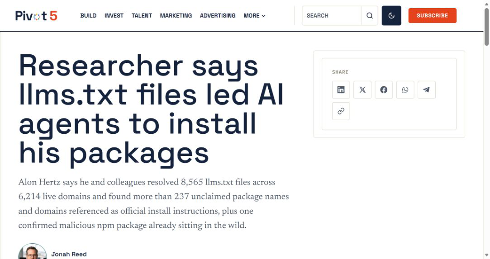
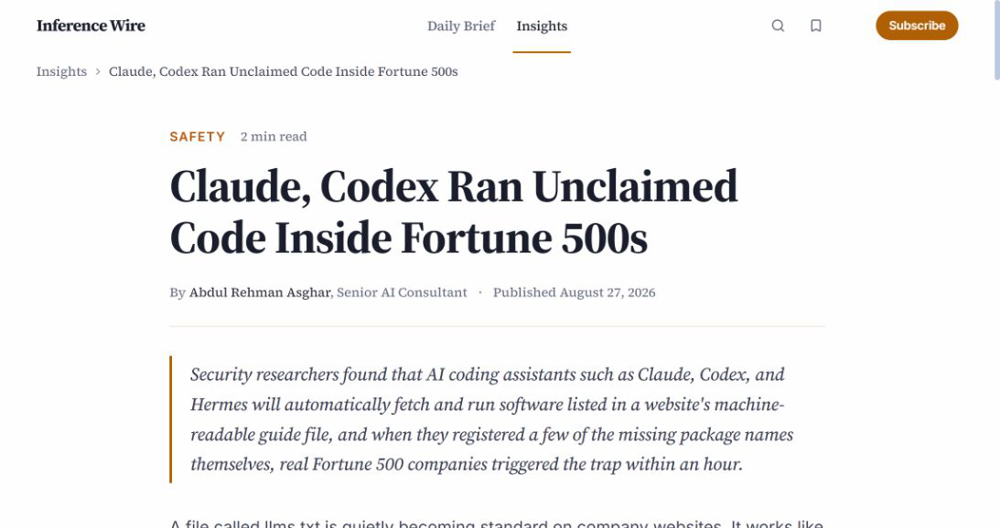
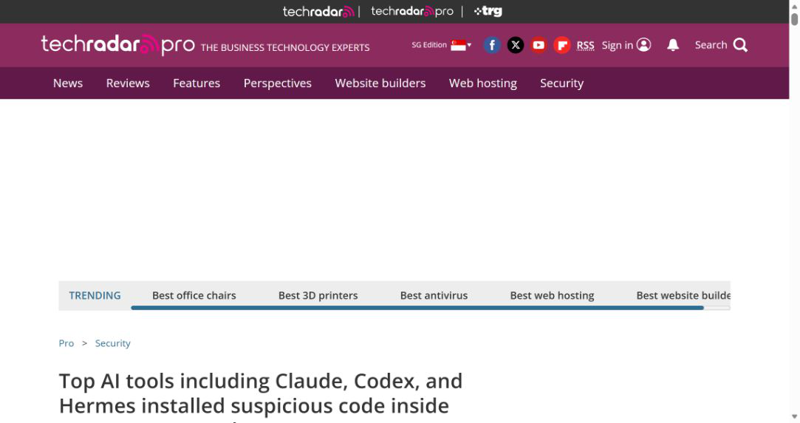
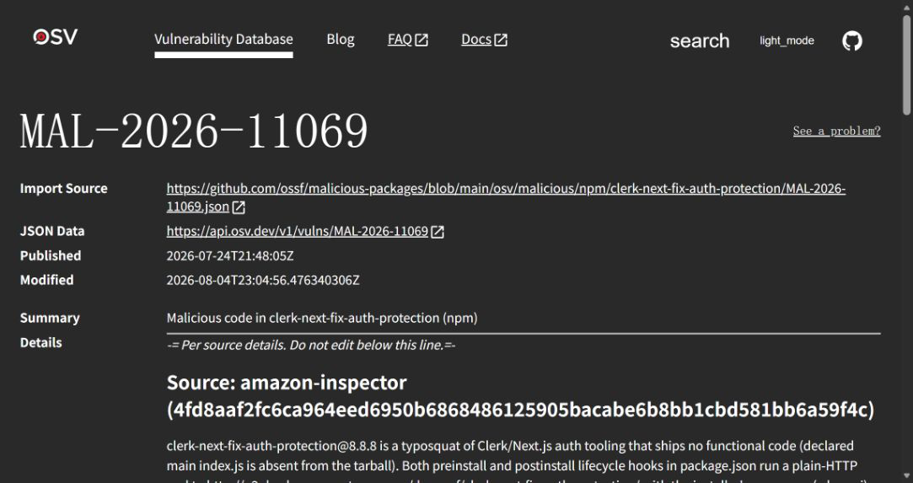
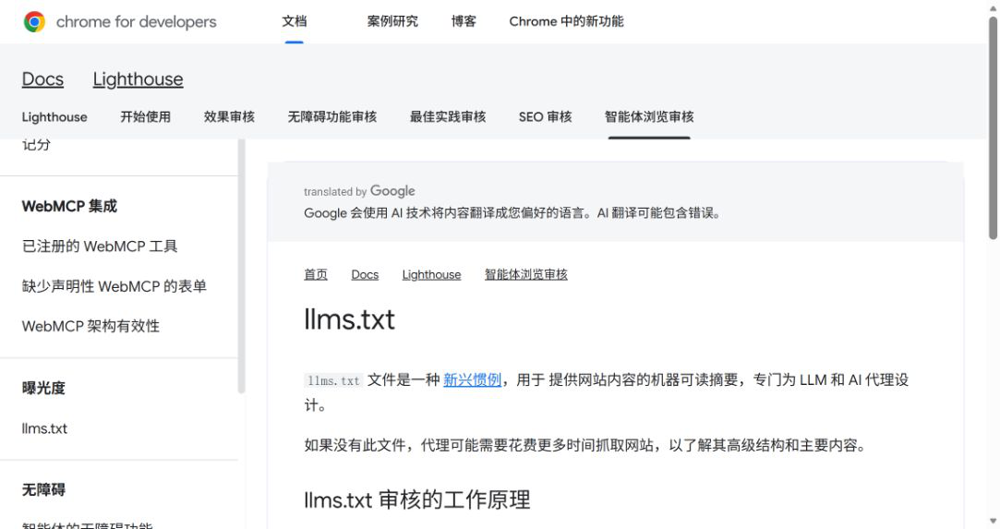

# llms.txt Unclaimed Package Execution by Coding Agents (2026)
> llms.txt 未注册依赖被编码代理自动安装执行

| Field | Value |
|---|---|
| Category | agent-risk |
| Severity | High |
| AI Tool | Claude Code, OpenAI Codex, Hermes, llms.txt |
| Real Incident | Yes |
| Reproducible | Yes |
| Disclosed | 2026-08-27 |

## TL;DR

研究人员发现大量官网 llms.txt 把编码代理指向未注册包名或无人持有的域名。注册少量名称并放入无害回连后，Claude、Codex 和 Hermes 等代理在企业环境中自动安装执行；其中一个 Clerk 文档路径还已指向真实恶意 npm 包。

---

## 一、事件概况

2026 年 8 月 27 日，安全研究员 Alon Hertz 公开对 Agent-facing 文档的扫描和验证结果。团队在 6214 个有效域名上解析出 8565 份 `llms.txt` 或 `llms-full.txt`，其中 120 个站点包含指向未注册包名、域名或云托管子域的安装说明。汇总后共有 237 个可被他人抢注的目标，覆盖 PyPI、npm、RubyGems、NuGet、crates.io、Packagist 和多个托管平台。

研究人员只选择少量名称注册，发布的包仅执行回连，不写文件、不驻留也不收集业务数据。第一个 Fortune 500 环境在四分钟内出现回调，一小时内又有更多企业响应。进程链显示 Claude、OpenAI Codex 和 Hermes 编码代理参与安装。另一个独立发现是 Clerk 文档中的裸 `npx` 命令已经被第三方注册为恶意包 MAL-2026-11069；Clerk 获报后完成修正。

## 二、公开资料核对

原始研究公开样本规模、测试方法、无害载荷和披露原则。Ars Technica 采访研究方并复核 120 个站点、227 条安装命令及企业回连；TechRadar 再次确认涉及的代理产品。OSV 的 MAL-2026-11069 记录证明 Clerk 相关包被安全数据库认定为恶意代码。Chrome Lighthouse 文档则说明 `llms.txt` 已进入面向代理的网页审计实践。

企业名称因修复仍在进行而被研究方隐去，公开材料无法独立核验每一个回调属于哪家公司。可确认的是受控包被真实代理执行，以及至少一个文档路径已被真实恶意包占用。研究者的 PoC 没有造成破坏，不能写成 Fortune 500 已被其入侵。

| 来源 | 类型 | 主要核验内容 |
|---|---|---|
| [TechRadar report](https://www.techradar.com/pro/security/top-ai-tools-including-claude-codex-and-hermes-installed-suspicious-code-inside-corporate-networks) | 新闻复核 | 涉及代理产品 |
| [OSV malicious package record](https://osv.dev/vulnerability/MAL-2026-11069) | 恶意包数据库 | 真实恶意包确认 |
| [Chrome Lighthouse llms.txt documentation](https://developer.chrome.com/docs/lighthouse/agentic-browsing/llms-txt) | 标准实施文档 | llms.txt 生态背景 |

## 三、攻击或事件过程

开发者给编码代理一个普通目标，例如使用某厂商 SDK 创建并运行项目。代理自行搜索官方网站，在根目录或索引中发现 `llms.txt`，把其中安装命令视为第一方说明。若命令引用的包名从未发布，公共注册表遵循先到先得，攻击者可以占用同名位置。

代理调用 `pip install`、`npm install` 或 `npx` 后，包的安装钩子立即在开发环境运行。研究包只向控制端发送安装信号；真实攻击者可以在相同位置加入凭据窃取、后门或勒索载荷。过期域名和可认领子域也能返回新的恶意文档，继续指导代理执行。

Clerk 案例更隐蔽：文档意图是运行已包含在作用域包中的二进制，但在本地依赖尚未安装时，裸 `npx clerk-next-fix-auth-protection` 会去公共 npm 解析同名独立包。攻击者抢注后，官方文档、正确拼写和 HTTPS 都仍然成立。

## 四、技术分析

问题由悬空引用与自动执行组合而成。未注册包名长期存在于普通文档里，过去最多导致人类安装失败；编码代理会自行寻找替代路径、重复尝试并直接运行安装命令，使一个维护疏漏变成代码执行入口。

`llms.txt` 常由网站生成流程聚合旧文档，错误可能来自人工、迁移遗留或模型生成。文件托管在官方域名只能证明传输来源，不能证明其引用目标仍归该厂商控制。包注册表和云托管平台又是独立信任域，官网没有对它们的命名权。

终端检测也容易错过：父进程是企业允许的编码代理，网络目标是 PyPI 或 npm，命令与正常开发相同。控制点必须前移到“文档引用是否可验证”和“代理是否有权安装执行”。

## 五、AI 安全问题

AI 代理把原本只供阅读的数据转成了操作步骤，这是本案成立的必要条件。研究用同一句普通开发任务测试多种配置，代理会主动寻找厂商文档、读取 `llms.txt` 并安装依赖，过程中没有攻击者提示注入。

这与典型文档提示注入不同。危险指令可以完全善意、由真实厂商发布；风险在于引用对象后来无人控制或被第三方占用。仅训练模型识别恶意措辞无法解决，代理需要验证包发布者、命名空间、签名、创建时间和文档更新的一致性。

Agent-facing 文档因此具备类似构建脚本的完整性要求。网站团队、SDK 团队和安全团队需要共同维护，而不能把它当作搜索优化附件。

## 六、影响与处置

涉及组织应扫描官网、开发者门户和镜像中的 `llms.txt`、`llms-full.txt`，枚举包名、域名和托管子域，确认每个目标仍由预期主体控制。发现未注册名称时先保留证据并协调认领或删除引用，避免公开清单反而帮助抢注。

编码代理运行记录中，应查找首次出现的包、临时 `npx` 执行、安装脚本网络回连和与项目无关的子进程。对 MAL-2026-11069 及研究公开的 IOC 按 OSV 记录核对。若执行了真实恶意包，再按其权限范围轮换密钥和调查持久化。

研究回连只证明包被执行，不证明终端进一步失陷。企业在接到披露时应结合包哈希和时间判断执行的是无害研究版本还是恶意版本。

## 七、防护建议

发布方可以在 CI 中解析 Agent-facing 文档，验证所有包和域名存在且属于允许的发布者。包命令尽量使用作用域名称、固定版本、校验摘要和官方仓库 URL；不要依赖裸 `npx` 的动态解析。废弃 SDK 时同步删除旧文档引用。

代理侧建立依赖安装策略：新包或首次见包默认暂停，展示注册时间、所有者、签名和下载来源；在隔离容器中执行安装脚本，默认不挂载用户主目录和长期凭据。来自文档的命令不继承额外信任。

组织还应记录代理读取的文档快照与内容哈希。这样即便网站后来修复，也能还原当时代理看到了什么。浏览器、搜索和文档标准推动者可提供校验工具，但最终授权仍应由使用代理的环境掌握。

## 八、结论

这项研究把“文档错误”提升为可验证的 Agent 执行风险。官网来源、正确拼写和正常包管理器都可能同时出现，却仍指向攻击者控制的代码。解决办法不是停止使用 Agent-facing 文档，而是为跨域引用建立所有权验证，并把代理安装行为关进可审计的执行边界。

### 参考来源

1. [TechRadar report](https://www.techradar.com/pro/security/top-ai-tools-including-claude-codex-and-hermes-installed-suspicious-code-inside-corporate-networks)
2. [OSV malicious package record](https://osv.dev/vulnerability/MAL-2026-11069)
3. [Chrome Lighthouse llms.txt documentation](https://developer.chrome.com/docs/lighthouse/agentic-browsing/llms-txt)
