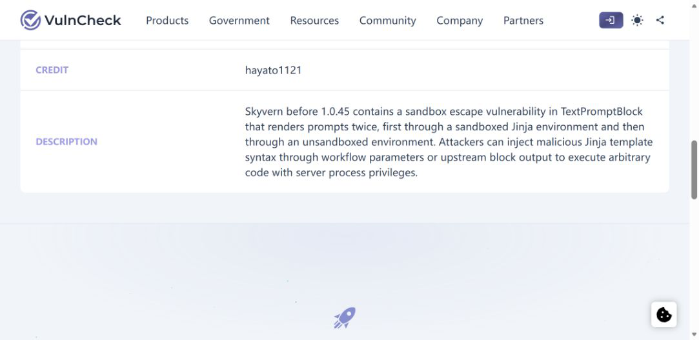
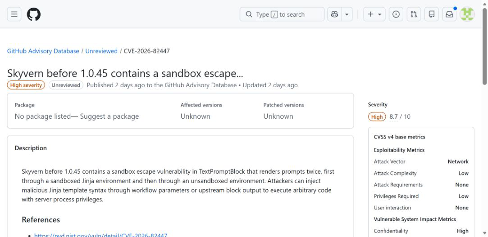
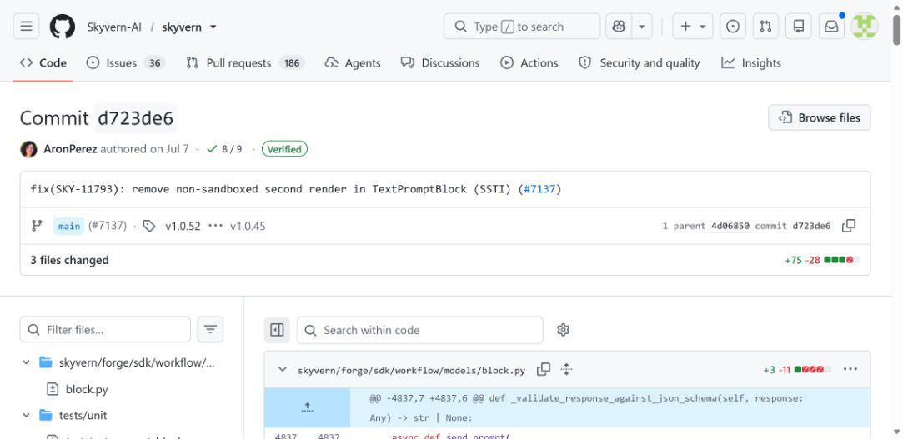
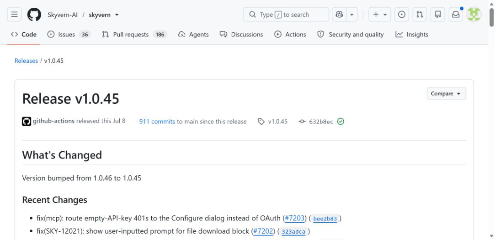
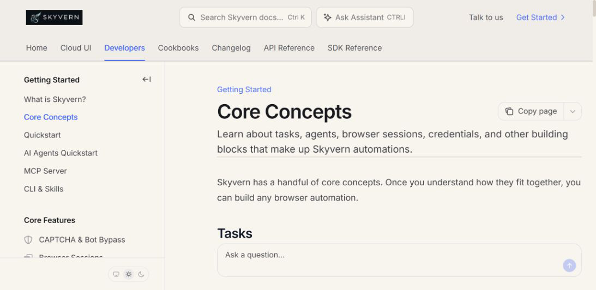

# Skyvern TextPromptBlock Sandbox Escape (2026)
> Skyvern 文本提示块二次渲染导致沙箱逃逸

| Field | Value |
|---|---|
| Category | code-vulns |
| Severity | High |
| CVE | CVE-2026-82447 |
| AI Tool | Skyvern TextPromptBlock and AI browser workflows |
| Affected | 0.2.1 to versions before 1.0.45 |
| Fixed | 1.0.45 |
| Public Exploitation | Not confirmed |
| Disclosed | 2026-08-29 |

## TL;DR

Skyvern 1.0.45 之前的 `TextPromptBlock` 存在一次危险的二次模板渲染。工作流参数或前序块输出先经过沙箱化 Jinja 环境，被填入给大模型的提示；随后，这段已经包含外部数据的文本又被普通 Jinja 环境解析。攻击者只要能影响这些输入，就可能让本应作为文字进入模型的模板语法在服务器端执行，取得 Skyvern 服务进程权限。项目于 7 月 6 日合入修复，1.0.45 在次日发布；CVE 记录于 8 月 29 日公开。现有公开资料证明漏洞与修复真实存在，但没有报告在野利用或已确认受害者。

---

## 一、事件概况

Skyvern 是面向网页操作的 AI 自动化平台。用户可以用自然语言描述任务，也可以把多个块连接成可重复运行的工作流。`TextPromptBlock` 是其中的纯文本大模型调用块，常用于归纳前序步骤的结果、生成下一步所需内容，或结合工作流参数生成文本。官方文档明确说明，工作流支持参数化运行，并允许后续块引用前序块输出。也正因为这些值会进入提示模板，它们同时构成了模板引擎的输入面。

CVE-2026-82447 对应的缺陷位于 Skyvern 的提示构造流程。受影响版本从 0.2.1 起，直到 1.0.45 之前。VulnCheck 与 GitHub Advisory Database 的描述一致：`TextPromptBlock` 把提示渲染两次，第一次使用受限的 Jinja 沙箱，第二次却进入普通环境。若工作流参数或上游块输出包含 Jinja 模板语法，第一次替换后产生的新语法会在第二次解析中获得执行机会。

项目维护者于 2026 年 7 月 6 日提交修复，删除第二次非沙箱渲染以及与之相连的参数传递，并补充回归测试。1.0.45 版本于 7 月 7 日发布。漏洞编号和数据库条目到 8 月 29 日才公开，因此“公开日期”不能当作补丁日期。对防守方更有用的判断是实际运行版本是否低于 1.0.45，而不是服务器何时第一次收到 CVE 告警。

## 二、公开资料核对

本案的核心事实可以直接从代码和公告对应起来。VulnCheck 公告给出 CVE、受影响版本、输入来源和代码执行影响；GitHub Advisory Database 给出 CVSS 4.0 评分 8.7、CWE-1336 以及低权限、无需用户交互等评分条件。两者的文字都指向同一修复提交，不存在把多个相似缺陷拼在一起的情况。

项目提交是判断机制最直接的材料。差异内容显示，`TextPromptBlock.send_prompt()` 不再调用会重新解析字符串的 `load_prompt_from_string()`，代码注释说明提示在前一步已经完成渲染。新增测试还覆盖了工作流参数和上游输出携带模板表达式时应保持为普通文字的情况。发布页面则证明该提交进入 1.0.45。官方工作流文档补足产品语境：Text Prompt 的确会调用 LLM，工作流参数和块输出也确实可以被后续步骤引用。

这些来源能确认漏洞可达、影响严重且已经修复，但没有来源报告公开攻击活动。本文因此不使用“已遭入侵”“大规模利用”或“无人值守即可从互联网直接攻破所有实例”等说法。GitHub 的评分向量把权限要求列为 Low；具体部署是否允许低权限用户创建、修改或触发含有不可信数据的工作流，会决定攻击者能否走到漏洞位置。

| 来源 | 类型 | 主要核验内容 |
|---|---|---|
| [VulnCheck advisory](https://www.vulncheck.com/advisories/skyvern-before-1.0.45-sandbox-escape-via-textpromptblock) | 漏洞公告 | 受影响版本、输入位置、二次渲染和代码执行影响 |
| [GitHub Advisory Database](https://github.com/advisories/GHSA-57gg-9j2p-5v4x) | 公共漏洞数据库 | CVE、CVSS 4.0、CWE 与利用条件 |
| [Skyvern security fix commit](https://github.com/Skyvern-AI/skyvern/commit/d723de621d5b3a340f3cc4d5b46bfe40a9a3124e) | 项目修复提交 | 删除非沙箱第二次渲染及新增回归测试 |
| [Skyvern v1.0.45 release](https://github.com/Skyvern-AI/skyvern/releases/tag/v1.0.45) | 项目发布记录 | 修复进入正式版本的时间和版本号 |
| [Skyvern workflow core concepts](https://www.skyvern.com/docs/developers/getting-started/core-concepts) | 官方产品文档 | Text Prompt、参数、上游输出和工作流运行方式 |

## 三、攻击过程

攻击链从一个正常的参数化工作流开始。创建者在提示模板中引用运行参数，或引用前序提取、文件解析、HTTP 请求等块的输出。第一次渲染负责把这些值填入提示。此时外部值按设计应当只是数据：例如网页提取出的文字、表单内容、客户提供的描述，或者另一个 AI 步骤生成的文本。即使值中出现模板定界符，也不应改变工作流程序结构。

受影响代码随后又把完整提示交给普通 Jinja 环境处理。这样一来，第一次渲染刚插入的字符串不再保持原样，而会被当成新的模板源码。攻击者不需要突破第一次使用的沙箱；他利用的是两个渲染阶段之间的语义变化。第一阶段把输入放进结果，第二阶段再把结果解释成代码，这就是典型的二次渲染问题。

能够控制输入并不等于已经取得服务权限。攻击者仍需具备向目标工作流提供参数、影响某个上游块输出，或通过业务入口让不可信内容进入该输出的条件。随后目标还要运行受影响的 `TextPromptBlock`。一旦链路成立，执行发生在模型请求之前，权限属于 Skyvern 服务进程，而不是浏览器页面中的访客身份。服务账号能读取哪些环境变量、访问哪些数据库或网络资源，决定了实际后果。

修复后的流程只保留一次受限渲染。参数和前序输出被填入后，结果直接作为提示发送，不再进入第二个模板解释器。这样的改动看起来很小，却切断了数据重新变成模板代码的机会。升级后还需要重新启动实际工作进程并核对镜像摘要，否则控制面显示的新版本与仍在运行的旧 worker 可能不一致。

## 四、技术分析

漏洞的关键不是 Jinja 沙箱本身被攻破，而是沙箱结果被另一个不受限的解释器再次处理。单独查看第一步会以为模板输入已经受控，单独查看第二步又可能误以为传入的是应用生成的可信提示；只有追踪完整数据流，才能看到不可信值如何跨过两道调用并在后一步恢复为可执行语法。

这类缺陷很容易出现在支持变量插值的 AI 编排平台。平台往往有一套工作流模板语法，提示管理器又有另一套模板机制。为了支持系统提示、模型参数或复用提示，开发者可能在不同层分别调用渲染函数。只要后层看不到前层字段来源，已经转义或沙箱化的值就可能被重复解析。安全审查应搜索的是“渲染结果是否再次进入解释器”，而不只是每个调用点是否使用了安全 API。

GitHub Advisory 的 CVSS 4.0 基础分为 8.7，攻击向量为网络、复杂度低、需要低权限、无需另一名用户交互，对受影响系统的机密性、完整性和可用性均为高影响。这套评分描述的是满足前置权限后的技术后果。它没有证明公开实例必然允许匿名创建工作流，也不代表漏洞已经被自动化扫描利用。

部署方式会显著改变风险。单用户本地实例若只处理本人准备的数据，攻击面较窄；团队共享平台若允许多个成员编辑模板、从外部网站提取文本、接收 webhook 数据或导入工作流，输入来源更多。容器隔离可以限制主机影响，但容器通常仍持有数据库连接、LLM API 密钥、浏览器配置和任务数据。用 root 运行服务或挂载 Docker socket 会进一步放大后果。

## 五、AI 安全问题

这个漏洞与 AI 的关系不是名称上的关联。`TextPromptBlock` 本身就是把工作流数据送入大模型的组件，前序数据可能来自 AI 浏览器读取的网页，也可能来自另一个模型步骤。AI 自动化把传统模板注入的输入范围从“用户填写的几个字段”扩展到网页正文、文件内容、模型输出和外部服务响应。平台越擅长自主采集内容，越需要明确哪些内容永远只能作为数据。

同时，本案也说明并非所有 AI 安全问题都发生在模型推理阶段。恶意字符串在请求发给模型之前就可能被模板引擎执行，模型拒绝策略、提示注入检测和输出审核对此没有帮助。若排查只查看聊天记录，甚至可能看不到造成执行的那段输入，因为流程在生成模型请求时已经偏离。

工作流可组合性还会掩盖来源。管理员审查 `TextPromptBlock` 时看到的可能只是一个短变量引用，真正的数据来自数个步骤之前的网页抓取、文件上传或接口响应。上游块本身完成了预期任务，不会报错；危险发生在下游把输出重新解释时。因此，运行日志需要保留字段级来源、每次转换以及最终进入解释器的值，不能只留下最后的提示文本。

从 AI 系统设计角度看，提示模板、工具参数和网页内容应有不同的数据类型。前序块输出进入 Text Prompt 时默认按不可执行字符串处理；只有工作流作者显式编写的模板才允许求值。模型生成的文本也不应自动获得“由系统产生所以可信”的身份，它仍可能复述网页中的恶意内容，或把不完整输入组合成新的模板标记。

## 六、影响与排查

成功利用后，代码以 Skyvern 服务进程身份运行。自托管环境常把模型供应商密钥、数据库凭据、对象存储配置和浏览器自动化所需的认证材料交给该进程。攻击者可能读取这些信息、修改工作流数据、访问服务可达的内部网络，或干扰后续任务。影响上限取决于运行账号和容器权限，不能脱离部署配置直接写成主机完全失陷。

排查应先确认所有 API 服务、worker 和定时任务的实际版本。仓库已经更新、控制面镜像标签已改或依赖锁文件显示 1.0.45，都不足以证明运行中的进程已替换。可以核对容器镜像摘要、包版本、进程启动时间和部署记录，并检查是否还有旧 worker 消费任务队列。

对可能受影响的时间段，应关注含有模板定界符的工作流参数和上游输出，以及 `TextPromptBlock` 运行前后的异常子进程、文件访问和网络连接。模板字符本身可能出现在正常技术文本中，不能据此认定攻击；需要把可疑输入、对应工作流运行 ID、服务进程行为和凭据使用记录关联起来。若发现非预期执行，再按进程可访问范围轮换密钥并检查持久化修改。

公开来源没有给出在野利用记录，也没有披露受害组织。事件响应时应使用“存在受影响版本”与“发现利用证据”两个不同状态。前者要求升级和缩减权限，后者才需要按入侵事件扩大取证、隔离和凭据处置范围。

## 七、防护建议

最直接的措施是升级到 1.0.45 或更高版本，并确认所有执行工作流的进程都已滚动更新。不能立即升级时，应暂停不可信用户可编辑或可触发的 `TextPromptBlock`，限制外部内容进入工作流参数和前序输出，同时把服务运行账号的文件、网络和凭据权限降到完成任务所需的最小范围。

开发层面应建立“只渲染一次”的约束。模板源码与替换值使用不同类型，渲染后的对象不再被任何模板 API 接收；确实需要多阶段模板时，每一阶段都只允许开发者控制的模板结构，并对值使用不可重新解释的表示。代码审查和静态检查可以跟踪 `render()`、`from_string()`、提示加载器及其返回值，发现渲染结果流向第二个解释器的路径。

工作流平台还应记录输入来源。网页提取、文件内容、webhook、人工参数和模型输出在界面及运行记录中分别标注，跨块传递时保留标签。包含外部数据的值进入提示模板、代码块、HTTP 请求或文件路径前，按目标上下文进行处理。这样既便于阻断注入，也能在异常发生后追溯是哪一步引入了内容。

运行环境应按任务隔离。服务进程不使用 root，不挂载宿主机管理接口，不把长期云密钥直接放入通用环境变量；浏览器凭据、LLM 密钥和数据库账号分开授权。对创建工作流、修改模板、导入定义和触发高权限运行分别审计。即使类似缺陷再次出现，代码执行也会停留在权限有限、生命周期短的 worker 内。

最后要把回归测试覆盖到组合输入，而不只测试开发者写在模板里的表达式。参数值、上游块输出和模型输出都应包含普通文本、模板定界符和嵌套引用场景，测试结果应证明它们原样进入提示。Skyvern 本次修复所增加的测试正体现了这一点：安全性质不是“沙箱没有报错”，而是外部值在第一次替换后不再被解释。

## 八、结论

CVE-2026-82447 是一个边界清楚的 AI 工作流运行时漏洞：外部数据进入面向大模型的提示后，被第二个非沙箱模板环境重新解释，最终可能变成服务器端代码。项目提交、发布记录和两份漏洞数据库条目在机制、版本和修复点上相互吻合。现阶段最准确的处置是确认版本、替换所有旧 worker、检查可疑工作流运行并压低服务权限，不把尚未公开的攻击活动写成既成事实。

本案也给 AI 编排平台一个很实际的提醒：模型上下文并不是普通字符串拼接的终点。网页、文件、接口和上游 Agent 产生的内容会在多个组件间流动，任何一次重新解析都可能改变它的安全含义。把模板结构限定为开发者控制、让外部值始终保持数据身份，比在最后一道提示上增加过滤更可靠。

### 参考来源

1. [VulnCheck advisory](https://www.vulncheck.com/advisories/skyvern-before-1.0.45-sandbox-escape-via-textpromptblock)
2. [GitHub Advisory Database](https://github.com/advisories/GHSA-57gg-9j2p-5v4x)
3. [Skyvern security fix commit](https://github.com/Skyvern-AI/skyvern/commit/d723de621d5b3a340f3cc4d5b46bfe40a9a3124e)
4. [Skyvern v1.0.45 release](https://github.com/Skyvern-AI/skyvern/releases/tag/v1.0.45)
5. [Skyvern workflow core concepts](https://www.skyvern.com/docs/developers/getting-started/core-concepts)
